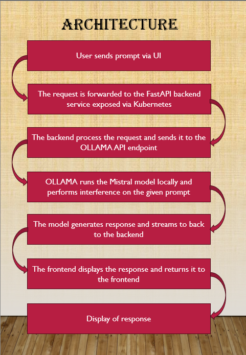
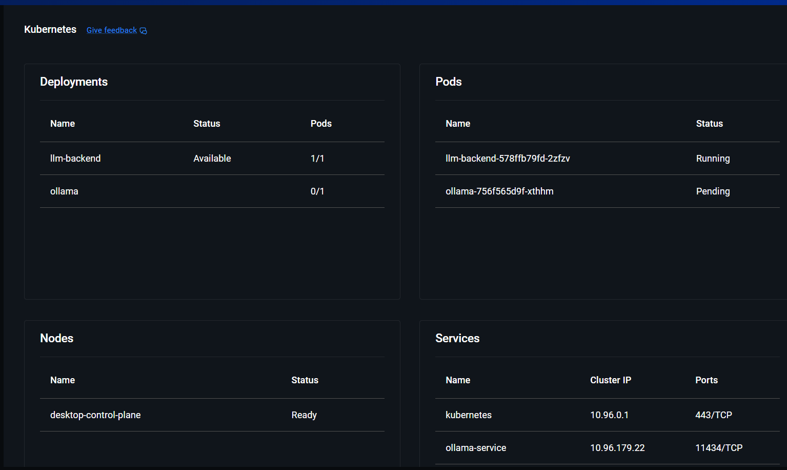
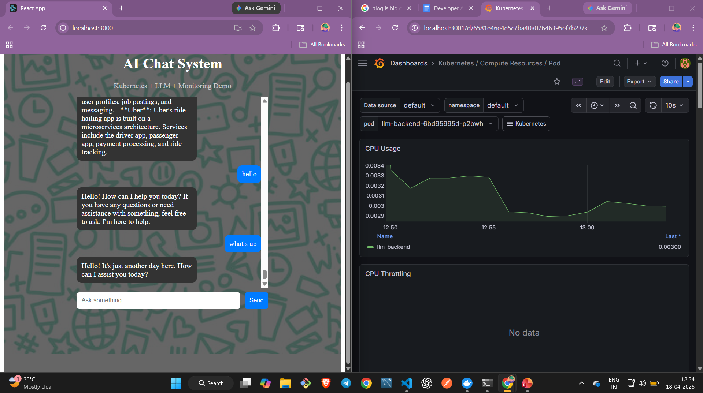
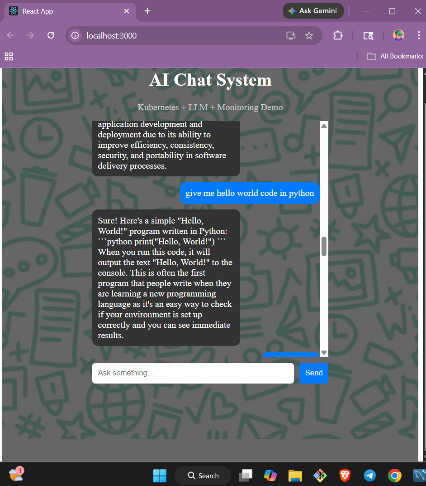
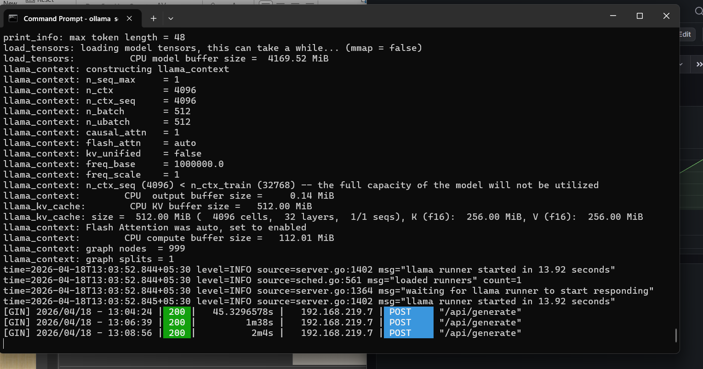

<div align="center">


<br/>

[](https://fastapi.tiangolo.com/)
[](https://kubernetes.io/)
[](https://docker.com/)
[](https://grafana.com/)
[](https://prometheus.io/)
[](https://python.org/)
[](https://reactjs.org/)
[](https://ollama.com/)

<br/>

> **LLM on Kubernetes** is a production-style AI deployment where an open-source LLM (Mistral 7B via Ollama)
> is served through a FastAPI backend running on Kubernetes, monitored with Prometheus + Grafana,
> and accessible via a React chatbot UI — all running locally.

<br/>

[🏗 Architecture](#-architecture) • [🏗 Screenshots](#-Screenshots) • [🚀 Features](#-features) • [⚙️ Setup](#%EF%B8%8F-installation) • [📊 Monitoring](#-monitoring) • [🆚 Comparison](#-mistral-vs-chatgpt) • [⚠️ Challenges](#%EF%B8%8F-challenges-faced)

</div>

---

## 💡 Why I Built This

I got a DevRel assignment from **DrDroid (YC-backed)** — deploy an open-source LLM on Kubernetes reliably, monitor it with Grafana, and build a chatbot UI on top.

The word **"reliably"** is what made it interesting. Anyone can run a model. Running it in a way where you know when it breaks, can fix it fast, and can scale it — that's the real challenge.

This repo documents exactly what I built, what broke, and how I fixed it.

---

## ✨ Features

| Module | What it does |
|--------|-------------|
| 🤖 **Mistral 7B** | Open source LLM running locally via Ollama |
| ⚡ **FastAPI Backend** | REST API bridge between UI and LLM |
| ☸️ **Kubernetes** | Manages backend deployment, scaling, restarts |
| 📊 **Grafana Dashboard** | Live cluster health — CPU, memory, pod status |
| 🔥 **Prometheus** | Metrics collection from the entire cluster |
| 💬 **React Chatbot UI** | Clean frontend to chat with your own AI |
| 🆚 **LLM Comparison** | Mistral vs ChatGPT on 10 prompts — cost, speed, quality |

---

## 🏗 Architecture

```
You (Browser)
      │
      ▼
React Frontend (localhost:3000)
      │
      ▼
FastAPI Backend ──── Kubernetes Deployment (port 8000)
      │
      ▼
Ollama + Mistral 7B (running locally — port 11434)
      │
      ▼
Prometheus ──── scrapes cluster metrics every 15s
      │
      ▼
Grafana ──── visualizes everything on live dashboard
```

Every component has one job. That's what makes it reliable.

---
## 📷 Screenshots

### 🏗 Architecture
| System Flow |
|:-----------:|
|  |

### ☸️ Kubernetes
| Pods Running |
|:-----------:|
|  |

### 📊 Grafana Monitoring
| Live Dashboard |
|:--------------:|
|  |

### 💬 Chatbot UI
| Chat Interface |
|:--------------:|
|  |

### 🤖 Mistral Running Locally
| Mistral via Ollama |
|:-----------------:|
|  |

---

## 📁 Project Structure

```
llm-k8s-project/
│
├── backend/
│   ├── main.py              ← FastAPI app — /chat endpoint
│   ├── requirements.txt     ← Python dependencies
│   └── Dockerfile           ← Containerizes the backend
│
├── frontend/
│   └── dr-droid/            ← React chatbot UI
│
└── k8s/
    ├── backend-deployment.yaml   ← Kubernetes deployment config
    └── backend-service.yaml      ← Exposes backend inside cluster
```

---

## 🤖 How the LLM Works

Mistral 7B runs locally via **Ollama** — a tool that serves open-source models through a simple REST API. No OpenAI account needed. No API cost. No data leaving your machine.

```
User types prompt
       │
       ▼
FastAPI receives POST /chat
       │
       ▼
Calls Ollama API at http://YOUR_IP:11434/api/generate
       │
       ▼
Mistral 7B processes the prompt
       │
       ▼
Response returned to UI
```

The FastAPI backend is the bridge. Kubernetes manages that backend. Grafana watches everything.

---

## ⚙️ Installation

### Prerequisites
- Docker Desktop with Kubernetes enabled
- Python ≥ 3.10
- Node.js ≥ 18
- Helm (for Grafana install)
- Ollama installed from [ollama.com](https://ollama.com)

---

### 1. Clone the repo

```bash
git clone https://github.com/rohitjadhav8849/llm-k8s-project.git
cd llm-k8s-project
```

---

### 2. Start Ollama + Pull Mistral

```bash
ollama pull mistral
ollama serve
```

Verify it works:
```bash
curl http://localhost:11434/api/tags
```

---

### 3. Find your machine IP

```bash
# Windows
ipconfig

# Mac/Linux
ifconfig
```

Copy your WiFi **IPv4 address** — you'll need it in the next step.

---

### 4. Update backend URL

Open `backend/main.py` and set:
```python
OLLAMA_URL = "http://YOUR_IP:11434/api/generate"
```

---

### 5. Build Docker image

```bash
cd backend
docker build -t llm-backend:latest .
```

---

### 6. Deploy to Kubernetes

```bash
cd ../k8s
kubectl apply -f backend-deployment.yaml
kubectl apply -f backend-service.yaml

# Verify pod is running
kubectl get pods
```

---

### 7. Access the backend

```bash
kubectl port-forward svc/llm-backend-service 8000:8000
```

Test it:
```bash
curl -X POST http://localhost:8000/chat \
  -H "Content-Type: application/json" \
  -d '{"prompt": "Which model are you?"}'
```

---

### 8. Start the frontend

```bash
cd ../frontend/dr-droid
npm install
npm start
```

Open `http://localhost:3000` — your chatbot is live.

---

## 📊 Monitoring

Install Prometheus + Grafana in one command using Helm:

```bash
helm repo add prometheus-community \
  https://prometheus-community.github.io/helm-charts
helm repo update

helm install monitoring \
  prometheus-community/kube-prometheus-stack
```

Access Grafana:
```bash
kubectl port-forward svc/monitoring-grafana 3000:80
```

Open `http://localhost:3000`
- Username: `admin`
- Password: run `kubectl get secret monitoring-grafana -o jsonpath="{.data.admin-password}" | base64 --decode`

### What I Could See Live

| Metric | What it showed |
|--------|---------------|
| CPU usage | Spiked during model inference |
| Memory | Increased with longer prompts |
| Pod status | All pods Running or restarted |
| Network | Traffic between backend and Ollama |

---

## 🆚 Mistral vs ChatGPT

I ran the same 10 prompts on both. Here's the summary:

| Metric | Mistral 7B (Local) | ChatGPT (GPT-4o) |
|--------|-------------------|-----------------|
| Cost | **$0 forever** | ~$0.01/query |
| Speed | 8–15 seconds | 2–3 seconds |
| Coding quality | Very good | Excellent |
| Current events | ❌ No internet | ✅ Up to date |
| Data privacy | ✅ 100% local | ❌ Sends to server |
| Overall quality | 3.5 / 5 | 4.8 / 5 |

**Verdict:** Mistral for private/cost-sensitive use cases. GPT-4 for customer-facing products where quality is non-negotiable.

---

## ⚠️ Challenges Faced

### ❌ localhost doesn't work inside Kubernetes
- **Cause:** Inside a pod, `localhost` refers to the pod itself — not your laptop
- **Fix:** Use the machine's actual WiFi IP address in the Ollama URL

### ❌ ImagePullBackOff on Ollama pod
- **Cause:** SSL certificate error while pulling Docker image from registry
- **Fix:** Pull image manually first, then set `imagePullPolicy: Never` in YAML

### ❌ Port already in use error
- **Cause:** Ollama was already running in background, `ollama serve` threw error
- **Fix:** It was actually working fine — the error was misleading. Verified with `curl`

### ❌ Docker build timeout
- **Cause:** pip install timing out during image build
- **Fix:** Added `--default-timeout=100` flag to pip install

---

## 🔮 Future Improvements

- [ ] Deploy Ollama inside Kubernetes with persistent volume
- [ ] Add GPU support for faster inference
- [ ] OpenTelemetry for distributed tracing
- [ ] Deploy on AWS EKS or GKE
- [ ] Add streaming responses to chatbot UI
- [ ] Set up auto-scaling based on CPU metrics

---

## 📹 Video + Blog

- 🎥 **Video Walkthrough:** [YouTube Link]
- 📝 **Full Blog:** [Hashnode Link]

---

## 👨‍💻 Author

<div align="center">

**Rohit Jadhav**
*NIT Silchar (3rd Year) · Full Stack Developer · DevOps Enthusiast*

[](https://linkedin.com/in/your-profile)
[](https://github.com/rohitjadhav8849)

</div>

---

<div align="center">

**⭐ Star this repo if you found it useful — it helps others find it too! 🚀**

*Built in 3 days as part of a DevRel assignment · Deployed on local Kubernetes · Monitored with Grafana*

</div>